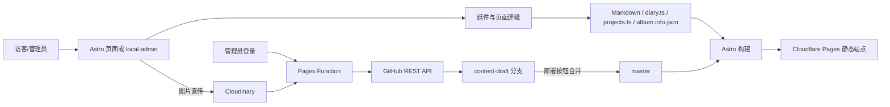

# 1. 项目是什么

项目名称是 Mizuki（当前仓库为 `my-Mizuki`）。它是一个基于 Astro 的中文个人博客/个人主页，用于展示文章、日记、相册、项目、技能、时间线等内容，并提供响应式布局、深色模式、搜索、文章加密、图片画廊和多语言基础设施。

当前项目以中文为主要语言，站点输出为静态 HTML。文章、日记、项目和相册内容都保存在仓库中，推送到 GitHub 后由 Cloudflare Pages 构建。仓库还包含一个可部署的 `/admin/` 可视化管理后台：后台登录后可编辑内容，图片上传到 Cloudinary，内容修改先提交到编辑分支，点击部署后再合并到 `master`，从而减少频繁构建。

# 2. 技术栈

- Astro 7：页面框架、静态构建和路由。
- TypeScript：配置、数据结构、工具函数和页面逻辑。
- Svelte：音乐播放器、搜索、设置等交互组件。
- Markdown/MDX：文章正文格式。
- Tailwind CSS 4：主要样式体系；部分组件使用 Astro scoped CSS。
- Vite：Astro 开发服务器和构建插件。
- Astro Content Collections + Zod：文章集合加载和 frontmatter 校验。
- unified/remark/rehype：数学公式、Mermaid、PlantUML、代码块、目录、链接和自定义 Markdown 语法处理。
- Toast UI Editor：后台文章富文本编辑器。
- Pagefind：构建后生成站内搜索索引。
- Cloudflare Pages Functions：线上后台 API、登录会话和 GitHub 操作。
- GitHub REST API：线上后台读取、创建、更新、删除仓库内容。
- Cloudinary Unsigned Upload：后台图片直传，当前统一使用 `boke` 目录。
- pnpm：依赖管理和项目命令执行。

# 3. 核心目录

- `src/pages/`：页面入口和路由。文章、相册详情、日记、项目以及 RSS/API 页面都在这里。
- `src/components/`：可复用 Astro/Svelte UI，包含导航、文章卡片、相册画廊、日记卡片、项目卡片、播放器等。
- `src/layouts/`：页面骨架，重点是 `Layout.astro` 和 `MainGridLayout.astro`。
- `src/config/`：站点总配置、主题、页面开关、导航和功能选项。
- `src/content/posts/`：文章 Markdown/MDX 文件。
- `src/data/`：日记、项目、技能、时间线等 TypeScript 数据。
- `public/images/albums/`：本地相册目录，每个相册通常包含 `info.json` 和本地图片；Cloudinary 图片记录也写入 `info.json`。
- `src/plugins/`：Markdown remark/rehype 扩展和构建期内容处理。
- `src/loaders/`：自定义文章加载器，负责读取文件并处理日期标记。
- `functions/`：Cloudflare Pages Functions。线上 `/api/admin/*` 后端位于此处。
- `local-admin/`：完整可视化管理后台源码和 Toast UI/Lucide 资源。构建时复制到 `dist/admin/`。
- `scripts/`：同步内容、规范化文章日期、复制后台、更新外部数据和构建检查脚本。
- `tests/`：Markdown、布局、图片、播放器和加密相关测试。

# 4. 核心文件

- `astro.config.mjs`：Astro、Markdown、Vite、字体和插件总入口。修改构建、Markdown 解析或开发插件时先看这里。
- `src/config/siteConfig.ts`：站点标题、语言、站点地址、功能页开关、横幅、导航、主题和图片优化配置。改站点行为通常先看这里。
- `src/content.config.ts`：文章集合 schema。`published` 必须是日期，frontmatter 字段不符合这里会导致构建失败。
- `src/loaders/post-loader.ts`：文章文件加载和日期-only 标记处理。
- `src/utils/content-utils.ts`：文章集合读取、排序、上一篇/下一篇关系和列表数据。
- `src/pages/[...page].astro`、`src/pages/[...permalink].astro`、`src/pages/posts/[...slug].astro`：首页、固定链接和文章详情渲染入口；项目没有单独的 `src/pages/index.astro`。
- `src/pages/albums.astro`、`src/pages/albums/[id]/index.astro`：相册列表和详情页。
- `src/utils/album-scanner.ts`：扫描本地相册、选择封面、排除 `cover.*`、合并 `info.json` 中的远程图片。改相册读取逻辑先看这里。
- `src/data/diary.ts`：日记数据和日记查询函数。
- `src/data/projects.ts`：项目数据、状态和项目查询函数。
- `local-admin/index.html`：后台全部界面和浏览器端逻辑，包括文章富文本、Cloudinary 上传、日记/项目/相册管理。
- `scripts/prepare-admin.mjs`：构建后把 `local-admin/` 复制为 `dist/admin/`，不要只修改生成目录。
- `scripts/normalize-post-frontmatter.mjs`：构建前把带引号的日期规范为 YAML 日期，避免 Astro schema 报错。
- `functions/api/admin/[[path]].js`：线上认证、Cookie 会话、GitHub 分支/文件读写、部署合并和相册图片元数据 API。
- `.github/workflows/deploy.yml`：当前 GitHub Actions 构建并发布 `pages` 分支的流程；Cloudflare 若使用 Functions，应直接连接包含 `functions/` 的 `master`。

# 5. 数据 / API

文章数据在 `src/content/posts/*.md` 或 `*.mdx`，正文是 Markdown，头部 frontmatter 至少需要 `title` 和 `published`。`published`/`updated` 应写成 `YYYY-MM-DD` 等 YAML 日期，而不是带引号的普通字符串。

日记在 `src/data/diary.ts` 的 `diaryData` 数组中；项目在 `src/data/projects.ts` 的 `projectsData` 数组中。相册元数据在 `public/images/albums/<id>/info.json`，本地图片位于同目录；远程图片以 `images` 数组记录 URL、public ID、名称和封面状态。

浏览器页面通过 `src/pages/api/` 提供的公开数据接口和构建期数据工作。线上管理 API 是 `functions/api/admin/[[path]].js`，包括登录、会话、文章、日记、项目、相册、相册图片和部署接口。后台前端通过同源 `/api/admin/...` 调用它，图片直接从浏览器上传到 Cloudinary。

重要环境变量/Secrets：`ENABLE_CONTENT_SYNC`、`CONTENT_REPO_URL`、`CONTENT_DIR`（可选内容分离）；`BILI_SESSDATA`（可选 Bilibili 数据）；`SESSION_SECRET`、`GITHUB_TOKEN`（线上后台必需）；`GITHUB_OWNER`、`GITHUB_REPO`、`GITHUB_BRANCH`、`GITHUB_EDIT_BRANCH`（GitHub 后台目标配置，默认仓库为 `chuanK6/my-Mizuki`，主分支 `master`，编辑分支 `content-draft`）。不要把 Token、密码或 Secret 写入源码。

# 6. 功能之间的关系



普通访问是“文件内容 → Astro 集合/扫描器 → 页面组件 → 静态 HTML”。管理员访问 `/admin/` 后，Function 先校验会话，再通过 GitHub API 读取编辑分支文件。保存只提交编辑分支，不触发构建；部署按钮请求合并编辑分支到 `master`，Cloudflare Pages 监听 `master` 后才重新构建。文章图片、日记图片、项目图片和相册图片均可先上传 Cloudinary，再把返回 URL 写入对应内容。

# 7. 怎么运行

在项目根目录执行：

```bash
corepack pnpm install
corepack pnpm dev
```

开发服务器默认端口是 `3000`，后台地址为 `http://localhost:3000/admin/`。本地开发时 `scripts/admin-vite-plugin.mjs` 会注入本地管理 API；该文件是本地辅助插件，不应部署到生产环境。

检查类型和 Astro 页面：

```bash
corepack pnpm exec astro check
```

完整构建：

```bash
corepack pnpm run build
```

构建命令会同步内容、更新可选数据、规范化文章日期、构建 Astro、复制后台到 `dist/admin`、生成 Pagefind 索引并检查字体/样式。预览构建结果：

```bash
corepack pnpm preview
```

仓库的 `.github/workflows/deploy.yml` 会在 `master` 推送时执行构建并发布 `pages` 分支。若要使用 Pages Functions，Cloudflare Pages 应连接包含根目录 `functions/` 的 `master`，构建输出目录为 `dist`；仅发布 `dist` 到普通静态分支不会自动启用 Functions。

# 8. 修改时注意什么

- 改文章页面先看 `src/content.config.ts`、`src/loaders/post-loader.ts` 和 `src/utils/content-utils.ts`，再看文章页面与文章组件。frontmatter 日期错误会直接阻断部署。
- 改相册先看 `src/utils/album-scanner.ts` 和两个相册页面。`cover.*` 不计入照片列表；没有封面时会使用第一张本地图片，远程图片来自 `info.json.images`。
- 改日记或项目要同时检查数据文件、对应页面组件和 `local-admin/index.html` 的字段映射。项目状态内部仍使用 `completed`、`in-progress`、`planned`，后台显示中文。
- 改后台界面只修改 `local-admin/index.html` 及其 `vendor` 资源；不要直接编辑 `dist/admin`，它会在下一次构建被覆盖。
- 改线上管理行为先看 `functions/api/admin/[[path]].js`。GitHub Token 只能在 Cloudflare Secret 中保存；前端只能调用同源 API。
- 保存与部署是两个动作：保存写入 `content-draft`，部署才合并到 `master`。修改分支逻辑时要考虑 GitHub 文件 SHA、并发编辑和 Pages 构建延迟。
- Cloudflare Web Crypto 的 PBKDF2 迭代次数上限为 `100000`，不要把后台密码哈希改成更高值。登录 Cookie 是会话 Cookie，关闭浏览器后应重新登录。
- Cloudinary 使用 unsigned preset，Cloud Name 和 preset 会出现在浏览器端，不能当作机密；应限制上传类型/大小并关注用量。删除相册图片主要删除 GitHub 中的元数据，Cloudinary 资源的彻底删除受删除令牌/权限限制。
- `astro.config.mjs` 中的 Markdown 插件顺序、字体配置和静态输出设置彼此有关，不要为解决单页问题随意移除全局插件。
- 保留用户已有文章、日记、项目、相册和图片。提交前运行 `astro check`、`pnpm run build`，并检查 `git diff --check`。

# AI 快速上手

这是一个 Astro 7 + TypeScript 的静态中文个人博客。文章在 `src/content/posts`，日记和项目分别在 `src/data/diary.ts`、`src/data/projects.ts`，相册在 `public/images/albums`，页面和组件主要位于 `src/pages`、`src/components`，总配置在 `src/config/siteConfig.ts`。相册扫描逻辑看 `src/utils/album-scanner.ts`，文章 schema 看 `src/content.config.ts`。后台源码是 `local-admin/index.html`，构建时复制到 `/admin`；线上 API 在 `functions/api/admin/[[path]].js`，通过 GitHub REST API 把保存内容写入 `content-draft`，部署按钮再合并到 `master`，Cloudflare Pages 才重建。图片直传 Cloudinary。安装依赖用 `corepack pnpm install`，开发用 `corepack pnpm dev`，检查用 `corepack pnpm exec astro check`，构建用 `corepack pnpm run build`。修改前先确认数据文件、页面组件、扫描器和后台字段是否联动，尤其保持文章日期为 YAML 日期且不要泄露任何 Secret。
